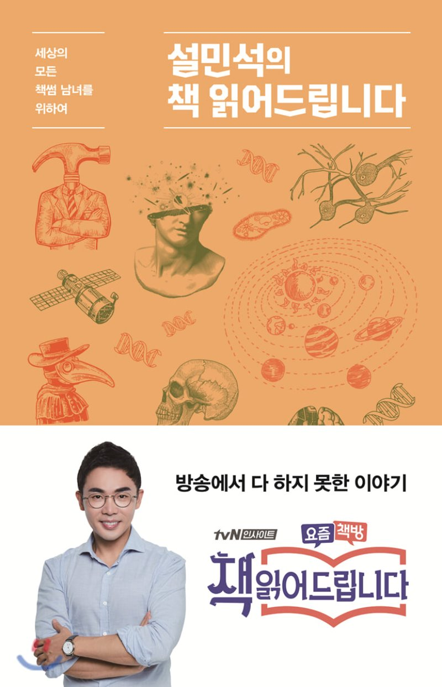

## 저자 : 설민석 / 단꿈아이

## 읽은기간 : 20. 05. 30 ~ 20. 05. 31

## 220 pages

### 최근 즐겨 보던 "tvN 책 읽어 드립니다" 가 종영 했다.

### 이책은 그 프로그램에서 소개 했던 책 중

### 5권을 골라 다시 재 구성된 내용이다.

### 주로 해당 편에서의 설민석의 강독 내용이 답겨 있다.

### 종영 해서 아쉽던 찰나에, 재밌겠다 싶어서 읽게 되었다.

### 1. 이기적 유전자 - 리처드 도킨스

### 2. 사피엔스 - 유발 하라리

### 3. 페스트 - 알베르 카뮈

### 4. 한중록 - 혜경궁 홍씨

### 5. 노동의 종말 - 제러미 리프킨

### 이중 기존에 내가 읽었던 책은 1,2 번.

### 설민석 저자의 강독도 물론 여러번 보았었다.

### 너무 내용 전달을 잘해 저자를 좋아하게 된 계기가 되었었다.

### 책의 서문에서 보니 방송하기전 무려 4번의 리허설을 한다고 한다.

### 그렇게 강의에 도가 튼사람도 미리 저정도의 준비를 한다니,

### 그정도 레벨의 결과물이 괜히 나오는게 아닌듯 싶다.

### 가장 인상 깊었던 내용은 한중록에 대한 내용이었다.

### 역시 저자가 우리나라 역사쪽의 전문가다 보니,

### 깊게 아는 내용들이 많아, 몰랐던것을 많이 알게 되었다.

### 2014년에 영화 사도를 봤을때도 생각이 났고,

### 영조, 사도세자, 정조에 대해 많은 생각을 하게 되었다.

