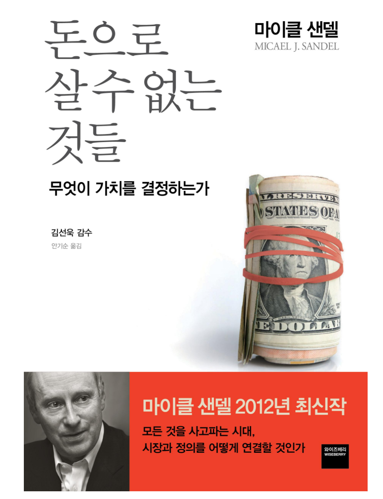

## 저자 : 마이클 샌델 / 와이즈 베리

## 읽은기간 : 20. 07. 15 ~ 20. 07. 26

## 333 pages

### 정의란 무엇인가의 저자 마이클 샌델이 쓴 책이다.

### 점점 무엇이든 사고 팔수 있는 세상이

### 되어 가고 있는 현대 사회에서 (특히 미국)

### 새치기, 인센티브, 생명보험, 사망채권, 명명권 등

### 여러가지 실사례를 들어,

### 과연 그것이 옳은것인가,

### 돈으로 살수 있는것은 무엇이며

### 살수 없는것은 무엇인가에 대한 고찰을 하고 있는 책이다.

### 저자는 사람들은 시장이라는 개념이 가치 중립적이라고 생각하지만

### 사실 어떤 재화에 대해,

### 시장주의 즉 값어치를 매기고, 사고파는 개념이 들어가면

### 그 재화의 특성을 변화 시킬수 있는 힘

### (주로 궁극적으로 부자든 가난한자든 모두에게 안좋은 쪽으로)

### 이 있다고 말한다.

### 따라서 어떤 가치에 대해 돈과 시장의 개념이 들어갈때,

### 그저 아무 생각없이 받아 들이거나

### 그냥 시장의 보이지 않는 손에게 맡기자

### 등의 생각보다는

### 각각의 사안들에 대해

### 어떻게 하는것이 옳은 것인지

### 시민의식을 가지고,

### 공적 담론과 토론, 깊은 고민을

### 해보고 대화와 합의를 해야한다고 충고 한다.

### 저자는 그러기 위해서 시민의 의무를 강조하며,

### 높은 시민 의식을 갖추어야 한다고 말한다.
