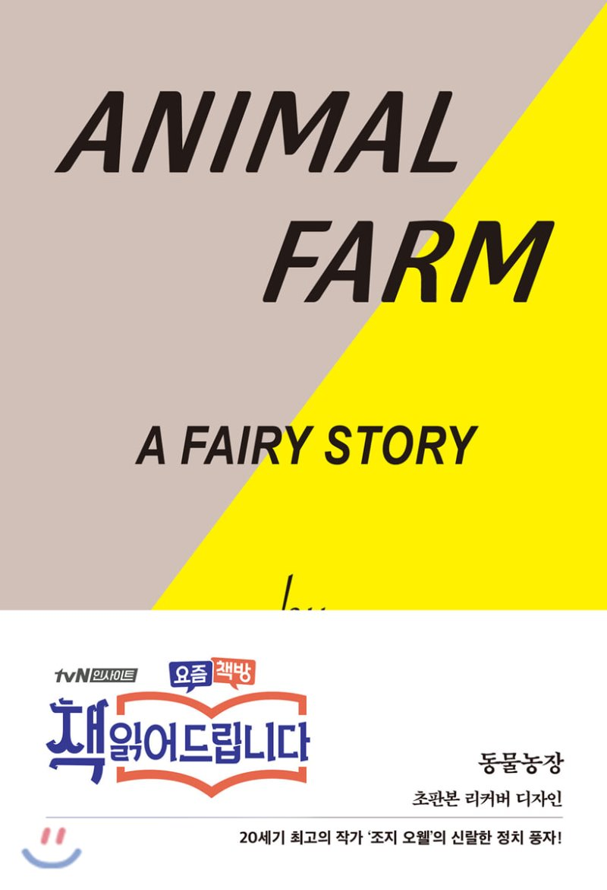

## 저자 : 조지 오웰 / 코너 스톤

## 읽은기간 : 20. 08. 01

## 181 pages

### 그 유명한 조지 오웰의 동물 농장.

### 1945년에 초판이 출판 되었다.

### 동물들이 등장하는 우화이지만

### 사실은 소련의 스탈린 주의를 까는 정치 소설이다.

### 혁명이 일어난 이후

### 권력욕을 가진 자들의 타락으로 인하여,

### 결국 혁명 이전과 다름없는 세상을 만들어버리는 내용.

### 긴 내용이 아니라, 하루만에 읽을수 있었다.

### 제정시대 - 소련 - 현대 러시아로 이어지는

### 러시아 근 현대사에 대해 알고 싶은 생각이 들었다.

