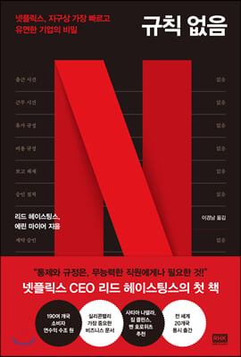

## 저자 : 리드 헤이스팅스, 에린 마이어 / 알 에이치 코리아

## 읽은기간 : 20. 10. 28 ~ 20. 11. 03

## 467 pages

### 넷플릭스의 공동 설립자중 한명인 리드 헤이스팅스와

### 기업 문화를 연구하는 교수인 에린 마이어가

### 넷플릭스만의 독특한 기업문화에 대해 쓴 책이다.

### 휴가규정, 비용규정, 출퇴근 규정, 계약승인 규정 등등이 없고

### 본인이 알아서 자유롭게 일하고, 책임지게끔 되어있는 문화가

### 어떻게 해서 만들어졌고, 어떤 장단점이 있는지 알려준다.

### 일단 비범한 최고의 인재들로 회사를 채우고,

### 업무 관련하여 서로에게 피드백을 확실히 주는 문화부터 시작하는데

### 일반적인 기업에서는 따라 하기 힘들겠다는 생각이 들었다.

### 적당히 성과를 내며 일하는 직원은 두둑히 퇴직금을 주고 내보낸다는 철학도 인상적이었다.

### 넷플릭스가 내부적으로 어떤식으로 일을 하는지에 대해

### 알게되어 도움이 된것 같다.

### 인상적인 부분은

### "회사는 가족이 아니라 프로스포츠 팀과 같다.

### 직장은 어떤 사람이 그일을 가장 잘할수 있고

### 그일을 하기에 가장 좋은 자리가 마련된 그런 마법

### 같은 기간에 전력을 다할수 있는곳이 되어야 한다.

### 더는 직장에서 배울것이 없거나 자신의 탁월성을 입증할 수 없다면,

### 그 자리를 자신보다 더 잘할수 있는 사람에게 넘겨 주고

### 자신에게 더 잘 맞는 역할을 찾아가야 한다."
