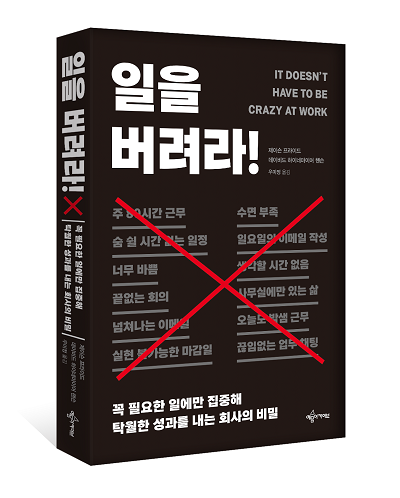

## 저자 : 제이슨 프라이드, 데이비드 하이네마이어 핸슨 저/우미정 역 / 예문아카이브(예문사)

## 읽은기간 : 20. 11. 05 ~ 20. 11. 08

## 311 pages

### BaseCamp를 공동 창업한 제이슨 프라이드와

### 데이비드 하이네 마이어 핸슨

### (루비 온 레일즈를 만든 개발자이기도 함)이 지은 책이다.

### 조용하고 남들(특히 고객들)에게

### 간섭을 받지 않는 개발 회사를 운영하기 위한

### 그들만의 규칙을 쓴 책이다.

### 또한 많은 회사들이 현재도 겪고 있는 문제들중 하나인

### 근로자들의 장시간 근무,극한의 업무량, 시간낭비 등등,

### 그에 비례해 늘지 않는 생산성과

### 제품 퀄리티의 문제를 해결하는

### 그들만의 경영 방법을 제시한다.

### 사실은 대단한 방법은 아니다.

### 실천하기가 어려워서 그렇지.

#### 무리하게 일정을 잡지 않는다.

#### 일정을 땡기지 않는다.

#### 개발자들에게 충분한 휴식 시간을 보장한다.

#### 복지를 보장한다.

#### 바쁘게 하지 않고 한가지 일에 집중하도록 한다.

#### 실시간으로 모든 의사소통을 하려하지 말고,

#### 비동기식으로 처리 하라.

#### 기능 추가에 목매지 않는다.

#### 고객에게 터무니 없는 약속을 하지 않는다. 등등

### 다 읽고 난 느낌은

### 역시나 기업 문화가 바뀌려면 일단

### 최고 경영진의 의지가 중요하다.

### 그리고 이들처럼 본인들의 원칙을

### 강하게 지켜 가려면

### 상장도 하지 않아야 할듯 싶다.
