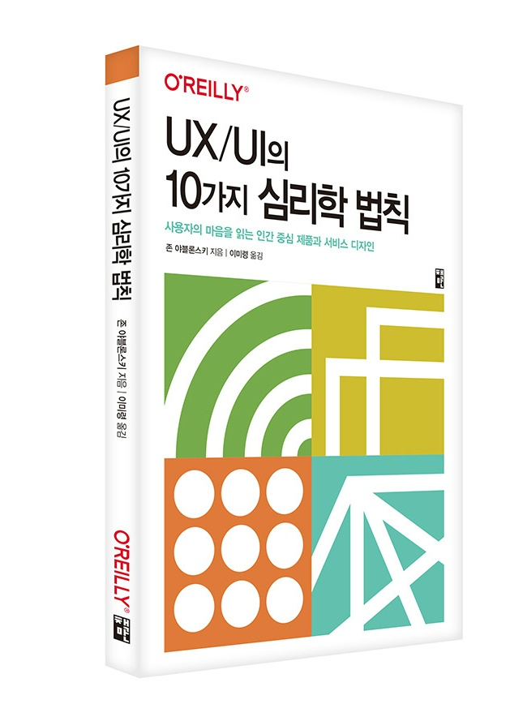

## 저자 : 존 아블론스키 /이미령 역 / 책만

## 읽은기간 : 20. 11. 11 ~ 20. 11. 20

## 163 pages

### 책 제목처럼 UX/UI에 대해 이론적으로

### 좀 더 근본있게 알고 싶어서 읽었다.

### 주로 웹페이지나 앱의 사용자 인터페이스나 동작을 디자인할때

### 고려해야 할 여러가지 원칙들을 다룬 책이다.

### 최대한 명확하고 간결하게,

### 빠르게 응답하는것 처럼 보이게

### 그리고 심미적으로 보기 좋은 디자인을 추구 해야 된다고 한다.

### 어찌보면 당연한 이야기들이 많이 쓰여져 있긴하다.

### 2.5/5

