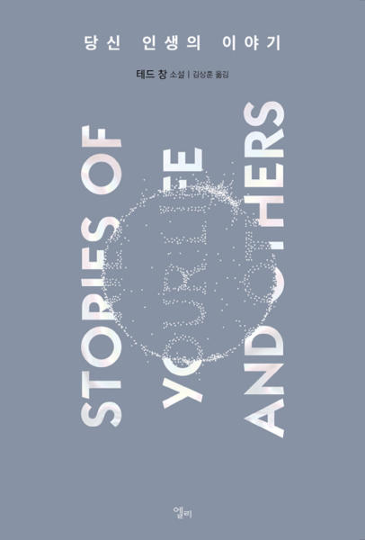

## 저자 : 테드 창 / 김상훈 역 / 엘리

## 읽은기간 : 20. 11. 15 ~ 20. 12. 13

## 448 pages

### 역시나

### 본인만의 탄탄하고 매력적인 설정의 SF 세계관을 만드는데

### 탁월한 작가 인것같다.

### 여러 단편중

### 네 인생의 이야기, 지옥은 신의 부재, 바빌론의 탑 순으로

### 인상 깊게 읽었다.

### 특히 아이가 생겨서 그런지

### 영화 컨택트의 원작이기도 한

### 네 인생의 이야기에서의 주인공에 감정이 많이 이입이 되었었다.

### 지옥은 신의 부재는

### 설정이 정말 매력적이었다.

### 결말도 너무 마음에 들었다.

### 이 양반 책은 한편씩 읽고 난뒤에

### 뭔가 생각할 거리가 떠오른다는 점도

### 역시 좋았다.

### 3.5/5

