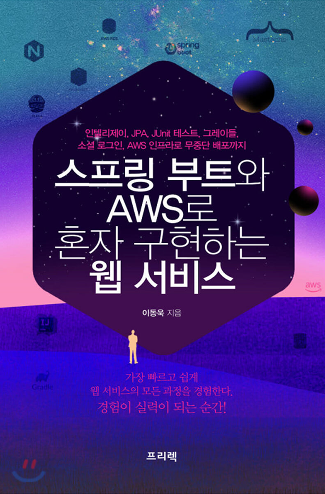

## 저자 : 이동욱  / 프리렉

## 읽은기간 : 21. 02. 19 ~ 21. 03. 07

## 409 pages

### 올해 1월에 이직을 하는등 이런저런 일로 바빠서

### 기술서든 교양서든 책을 읽을 기회가 거의 없었다가

### 주말에 맘먹고, 집중해서 읽었다.

### 결론적으로 도움이 많이 된 책이다.

### 스프링 부트는 이전 회사에서 조금 만져 본적은 있지만

### 여기서는 어쩌다 보니, 내가 완전히 서버 앱 하나를 맡게 되어서

### 공부를 해야 했다.

### 책 내용은 상당히 알차다.

### Spring boot , Spring security, 인텔리제이, JPA, UNIT 테스트, Gradle, AWS, 무중단 배포 등등

### 처음부터 시작해서 AWS에 서비스 배포까지 한번씩 다 따라할수 있게 되어있다.

### 저자의 내공도 상당히 깊어보인다.

### 실습도 다음 주말에 전부 해봐야겠다.

### 3/5
