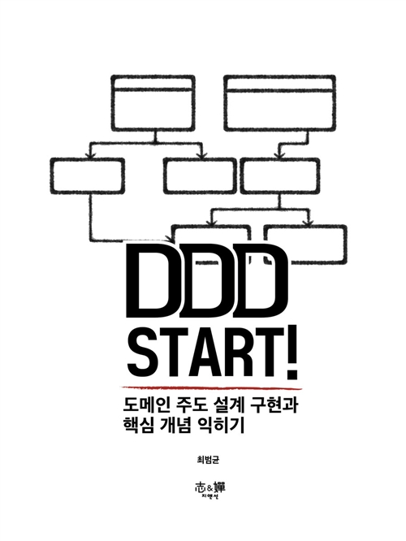

## 저자 : 최범균  / 지앤선

## 읽은기간 : 21. 03. 27 ~ 21. 04. 20

## 313 pages

### 도메인 주도 개발 DDD에 대해 기초 내용을 설명한 책 

### 서버 사이드의 아키텍처 설계에 대해 설명한다.

### 스프링/자바 쪽이라 예제 코드들은 읽는데는 지장은 없다.

### 띄엄띄엄 읽어서 지금은 좀 기억이 안나는데

### 일단 가장 기초 적인 개념은

### POJO, DTO, DAO등으로 지칭되는 도메인(모델) 클래스가 상태값만 들고 있지 말고, 

### 해당 도메인의 행위도 같이 정의 해서

### 서비스 레이어에서는 최대한 추상화된 메서드만 호출하도록 만드는게 핵심인것 같다. 

### 말은 쉽다만, 애플리케이션이 점점 복잡해지면, 이렇게 하는게 쉽지 않은게 사실

### 다만 역시 서버쪽을 많이 해보지 않아서 

### 중간 중간 다루는 내용들이 익숙하지도 않고 와닿는 부분도 초반 부분 외에는 없었다.

### 앞부분은 여러번 읽어도 좋을듯

### 설명을 중간에 건너 뛴 느낌이 드는 내용들이 좀 있다.

### 기초 설명 살짝 하고 바로 본론으로 들어가는 부분이 많다.

### 이해가 안될때가 있음

### 3.0/5
