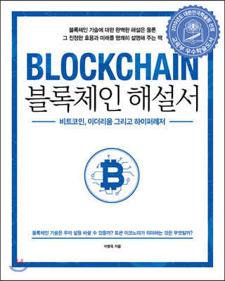

## 저자 : 이병욱  / 에이콘

## 읽은기간 : 21. 05. 07 ~ 21. 05. 17

## 350 pages

### 블록체인에 대한 기초 지식들을 쉽게 알려주는 책이다.

### 그렇지만 내용의 깊이는 상당하다.

### 전문가가 쓴 책이라는게 딱 티가 난다. 

### 읽어보면 돈이 아깝지 않다. 

### 저자인 이병욱님은 현재도 블록체인 전문가로 간간히 언론에도 나오고

### 최근에는 가상화폐 관련 토론에도 출연하신것으로 알고 있다. 

### 일단 가상화폐에 대해서는 굉장히 부정적인 입장이며,

### 블록체인도 현재 산업에서 쓰이기에는 아직 부족한점이 많으며, 많은 오해들이 있다고 이야기 한다. 

### 이책이 쓰여진 2018년 말 기준으로 , 비트코인 가격이 점점 더 떨어져서 0에 수렴할것이라고 했는데,

### 2021년 5월 현재, 2018년 대비 엄청난 폭등을 한것을 보면 틀린 예측도 있긴 하다. 

### 그렇지만 이분의 가상화폐, 블록체인 플랫폼에 대한 지식들은 

### 가상화폐 붐을 이용하여 말로 먹고 사는 가짜 전문가들과는 

### 다른 찐전문가라고 볼수 있을것 같다.

### 결론적으로 많이 도움이 되었다. 

### 4.0/5
