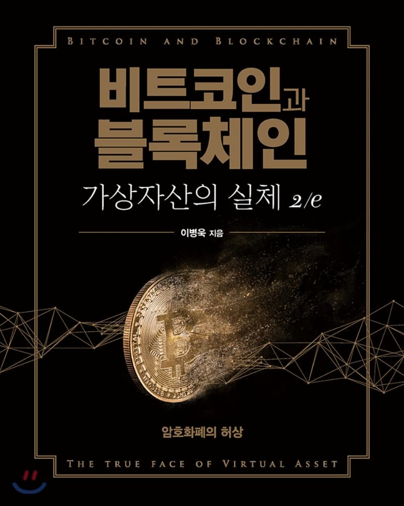

## 저자 : 이병욱  / 에이콘

## 읽은기간 : 21. 06. 01 ~ 21. 06. 06

## 311 pages

### 바로 전에 읽은 블록체인 해설서(2019년 2월 초판 발행)를 쓴 이병욱님의 책이다.

### 2020년 9월쯤 초판이 나온 책이다. 

### 내용은 블록체인 해설서가 기술적인 설명이 더 많다면,

### 이책은 법이나 투자 관점에 대한 설명들에 대해 더 집중하고 있다.

### 큰 틀에서 보면 내용이 많이 다르지는 않다. 한 70퍼센트는 같은 내용인것 같다. 

### 굳이 둘다 읽어볼 필요는 없었을듯 싶었다. 

### 3.5/5
