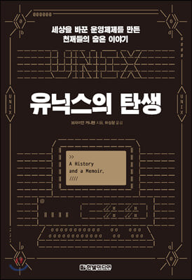

## 저자 : 브라이언 커니핸  / 한빛미디어

## 읽은기간 : 21. 05. 30 ~ 21. 06. 13

## 327 pages

### 유닉스의 개발 히스토리와

### 그리고 개발이 진행됐던 벨 연구소의 흥망성쇠에 대해

### 실제로 간접적으로 유닉스 개발에 참여했었고,

### 벨 연구소에 긴 시간을 몸담았던 저자에 의하여

### 쓰여진 책이다.

### 벨 연구소는 컴퓨터 역사에 어마어마한 영향력을 끼친 

### 사기업(거의 공기업 비슷한) AT&T 산하의 전설적인 연구소이다. 

### (벨 연구소 이야기라는 책을 한 10년전에 읽었던 기억이 있다.)

### 그안에서 직접 개발을 주도한 유닉스의 아버지라 할수있는 켄 톰슨과 

### C 언어를 창시하기도 한 데니스 리치가 중심인물이라 할수 있고,

### 그외에도 쟁쟁한 네임드 인물들이 등장한다.

### 저자가 부서장으로 있던 팀의 부서원이었던 C++언어의 비야네 스트롭스트룹, 

### vi와 Socket 인터페이스를 만든 썬마이크로 시스템의 창업자 빌조이,

### 잠시 인턴으로 거쳐갔던 에릭 슈미트,

### 스티브 잡스를 만났던 이야기 등등.

### 상당히 흥미로운 일화들을 많이 알수 있어 좋았다.

### 그리고 그 당시 자유로운 벨 연구소의 분위기와 

### 자기 연구에 몰입하는 연구자들의 이야기를 엿볼수 있었던 점도 좋았다. 

### 또한 유닉스로부터 오픈소스 활동들이 처음 시작 되었고,

### 최근 구글의 승리로 끝난, 

### 오라클과의 자바 API 특허 관련 소송 이전에

### 벨연구소의 순정 유닉스와 BSD간의 

### 인터페이스 관련 소송이 있었다는 것 등도 흥미로웠다.

### 3.0/5

