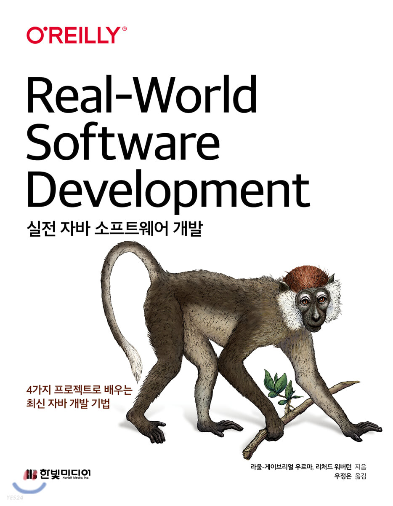

## 저자 : 라울-게이브리얼 우르마, 리처드 워버턴  / 한빛미디어

## 읽은기간 : 21. 06. 15 ~ 21. 06. 27

## 216 pages

### 자바 문법이나 프로그래밍 기본을 가르쳐주는 내용은 아니고

### 자바8 이후 버전을 이용하여, 

### 유지보수 하기 쉽고 좋은 품질의 소프트웨어를 개발하는 방법들에 대해

### 방대하진 않지만, 어느 정도 깊이 있게 알려주는 책이다.

### 소프트웨어 디자인을 어떻게 해야 하는지 좋은지,

### 구현은 어떤 원칙을 가지고 해야 하는지, 

### KISS, SOLID 등에 대한 이야기,

### 안티 패턴들은 무엇이 있는지,

### 테스팅 관련, TDD 방법론, Mocking ,

### 람다, 스트림, Optional 등 자바 8 이후의 추가된 기능들에 대해서도 이야기 한다. 

### 실전에서는 지키기 쉽지않은 부분도 있지만 

### 다 좋은 이야기이고 두번, 세번 새겨야 할 내용들이다.

### 가끔 모종의 이유로 개발이 잘 안될때,

### 내가 지금 뭘 만들고 있나, 삽질을 하고 있는것 같다 

### 싶을때 다시 꺼내 읽어도 좋을듯하다. 

### 대부분 챕터가 짧고, 어려운 내용이 많지 않아서

### 읽거나 이해하는데 시간이 많이 걸리지는 않는 편이었다. 

### 언어가 익숙한 자바라서 그렇기도 한듯.

### 개인적으로는 빌더패턴과 람다를 이용한, 

### 플루언트 API 설계 부분을 흥미롭게 읽었다.

### 설계할때나 리팩토링할때 잘 떠올려서 

### 앞으로 잘 써먹어야 봐야겠다.

### 이런 책은 쓸만한 내용 한 두가지만 

### 건져도 돈값 한다 생각한다. 

### 3.5/5
