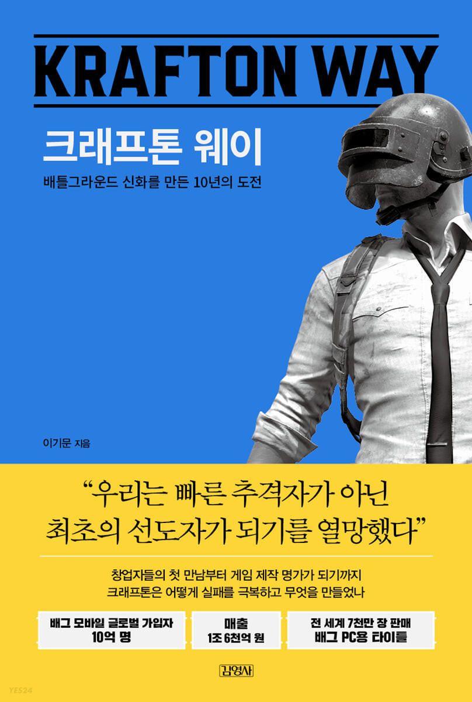

## 저자 : 이기문 / 김영사

## 읽은기간 : 21.09.09 ~ 20.09.17

## 544 pages

### 배틀 그라운드의 크래프톤의 지난 10년의 역사를 둘러 보는 내용이다.

### 창립 멤버이자 이사회 의장인 장병규를 중심으로 

### 그동안 어떤 일들이 있었는지 

### 가감없이 드러내는 점이 인상적이었다. 

### 그리고 재밌다. 

### 작가의 필력이 이야기를 흡입력있게 잘 풀어나간다. 

### 경영자로서 게임판에서 여러해를 보내면서 한 수많은 고민들, 

### 철학, 실수들과 게임 제작자들과의 논쟁 등을 간접 경험할수 있어서 좋았다.  

### (논란도 많기는 하지만 인물이긴 인물인듯, But 같이 일하고 싶진 않다고 생각했다)

### 4.0/5.0
